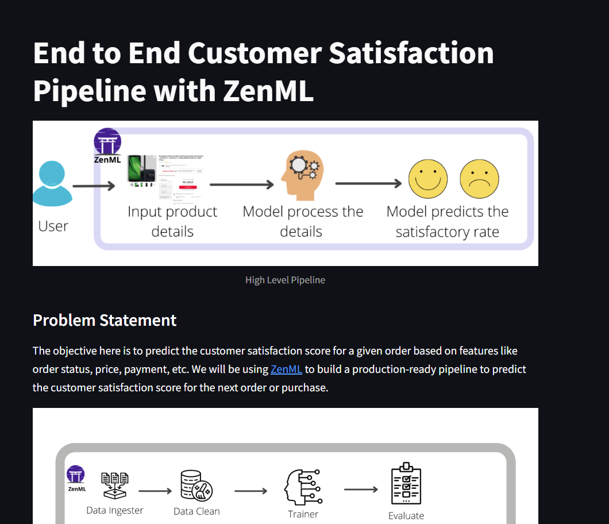
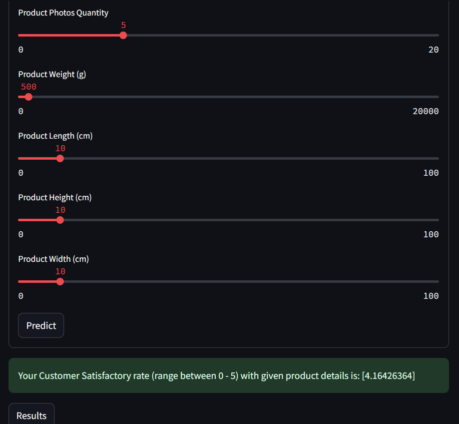

# End-to-end customer satisfaction prediction 

[](https://pypi.org/project/zenml/)

This project is designed to provide an end-to-end solution for forecasting how customers will feel about a product before they place an order. By leveraging features like order status, price, and payment method, the objective is to predict the customer satisfaction score for each transaction. To achieve this, [ZenML](https://github.com/zenml-io/zenml) is used to construct production-ready pipelines that can seamlessly predict satisfaction scores for future orders. This repository not only demonstrates how ZenML can streamline the process of building and deploying machine learning pipelines but also showcases the integration with tools like [MLflow](https://mlflow.org/) for tracking and deployment. Additionally, the application development is powered by [Streamlit](https://streamlit.io/), enabling easy visualization and real-time interaction with predictions.

## Dataset

The dataset used in the project is [Brazilian E-Commerce Public Dataset by Olist](https://www.kaggle.com/datasets/olistbr/brazilian-ecommerce). This dataset has information on 100,000 orders from 2016 to 2018 made at multiple marketplaces in Brazil. Its features allow viewing charges from various dimensions: from order status, price, payment, freight performance to customer location, product attributes and finally, reviews written by customers.


## Set up

### Run locally
Clone the project:

```bash
 git clone https://github.com/DimitrisReppas/MLOps_customer_satisfaction.git
```


### Set Up WSL and Ubuntu

The project is designed to work on Linux but can be developed or tested on a Windows machine. A Linux environment will be used since model-serving in mlflow is currently not supported on Windows.

1) Enable WSL. 
Open PowerShell as Administrator and run:

```bash
wsl --install
```
This command installs WSL and the latest Ubuntu distribution by default.

2) Install Ubuntu:

If Ubuntu is not installed automatically, you can install it from the Microsoft Store:

3) Launch Ubuntu:

After installation, open Ubuntu from the Start menu. This will open a terminal window where you can run Linux commands.

4) Run Your Commands:

In the Ubuntu terminal, run the following commands to set up your environment and run the code.

### Create and activate an environment

Download the latest version of the Miniconda installer for 64-bit Linux systems

```bash
wget https://repo.anaconda.com/miniconda/Miniconda3-latest-Linux-x86_64.sh
```
Install Miniconda 
```bash
bash Miniconda3-latest-Linux-x86_64.sh
```
Create and activate a conda environment

```bash
conda create -n your_env_name python=3.11 -y
```

```bash
conda activate your_env_name
```
### Install the requirements
To install the requirements for this project:

```bash
pip install -r requirements.txt
```
### Set up and configure ZenML to use MLflow for experiment tracking and model deployment

Initialize ZenML repository
```bash
zenml init
```
Install MLflow integration (needed for running the `run_deployment.py` script)
```bash
zenml integration install mlflow -y
```
Register MLflow experiment tracker
```bash
zenml experiment-tracker register mlflow_tracker --flavor=mlflow
```
Register MLflow model deployer
```bash
zenml model-deployer register mlflow --flavor=mlflow
```
Register and set the stack
```bash
zenml stack register mlflow_stack -a default -o default -d mlflow -e mlflow_tracker --set
```

## Run the pipelines

### Training Pipeline

This pipeline consists of several steps:

- `ingest_data`: This step will ingest the data and create a `DataFrame`.
- `clean_data`: This step will clean the data and remove the unwanted columns.
- `train_model`: This step will train the model and save the model using [MLflow autologging](https://www.mlflow.org/docs/latest/tracking.html).
- `evaluation`: This step will evaluate the model and save the metrics -- using MLflow autologging -- into the artifact store.

### Run the pipeline 

To run the pipeline
```bash
python run_pipeline.py
```

to see the pipeline

```bash
zenml up --blocking
```

and navigate to http://127.0.0.1:8237/

To launche the MLflow Tracking Server

```bash
mlflow server
```
and navigate to http://127.0.0.1:5000/

### Deployment Pipeline

The second pipeline is the `deployment_pipeline.py`, that extends the training pipeline, and implements a continuous deployment workflow. It ingests and processes input data, trains a model and then (re)deploys the prediction server that serves the model if it meets our evaluation criteria. The criteria that we have chosen is a configurable threshold on the MSE of the training. The first four steps of the pipeline are the same as above, but we have added the following additional ones:

- `deployment_trigger`: The step checks whether the newly trained model meets the criteria set for deployment.
- `model_deployer`: This step deploys the model as a service using MLflow (if deployment criteria is met).

In the deployment pipeline, ZenML's MLflow tracking integration is used for logging the hyperparameter values and the trained model itself and the model evaluation metrics -- as MLflow experiment tracking artifacts -- into the local MLflow backend. This pipeline also launches a local MLflow deployment server to serve the latest MLflow model if its accuracy is above a configured threshold.

The MLflow deployment server runs locally as a daemon process that will continue to run in the background after the example execution is complete. When a new pipeline is run which produces a model that passes the accuracy threshold validation, the pipeline automatically updates the currently running MLflow deployment server to serve the new model instead of the old one.

While this ZenML Project trains and deploys a model locally, other ZenML integrations such as the [Seldon](https://github.com/zenml-io/zenml/tree/main/examples/seldon_deployment) deployer can also be used in a similar manner to deploy the model in a more production setting (such as on a Kubernetes cluster). We use MLflow here for the convenience of its local deployment.


### Run the pipeline

To run the pipeline
```bash
python run_deployment.py
```

## Streamlit App

To round it off, a [Streamlit](https://streamlit.io/) application is deployed that consumes the latest model service asynchronously from the pipeline logic. This can be done easily with ZenML within the Streamlit code



### Run the app
To run this Streamlit app in your local system, you can run the following command:-

```bash
streamlit run streamlit_app.py
```

 You can now view your Streamlit app in your browser.

  in local URL: http://localhost:8501
   or Network URL: http://192.168.1.75:8501

## Summary

In order to build a real-world workflow for predicting the customer satisfaction score for the next order or purchase (which will help make better decisions), it is not enough to just train the model once.

Instead, an end-to-end pipeline for continuously predicting and deploying the machine learning model is built, alongside a data application that utilizes the latest deployed model for the business to consume.

This pipeline can be deployed to the cloud, scale up according to the needs, and ensure that the parameters and data that flow through every pipeline that runs are tracked. It includes raw data input, features, results, the machine learning model and model parameters, and prediction outputs. ZenML helps to build such a pipeline in a simple, yet powerful, way.

In this Project, a special consideration to the [MLflow integration](https://github.com/zenml-io/zenml/tree/main/examples) of ZenML is given. In particular, MLflow tracking is utilized to track the metrics and parameters, and MLflow deployment to deploy the model. The [Streamlit](https://streamlit.io/) is used to showcase how this model will be used in a real-world setting.


## Acknowledgement

This repository is inspired and based on https://github.com/ayush714/mlops-projects-course/tree/main and on https://www.youtube.com/watch?v=-dJPoLm_gtE&t=26s